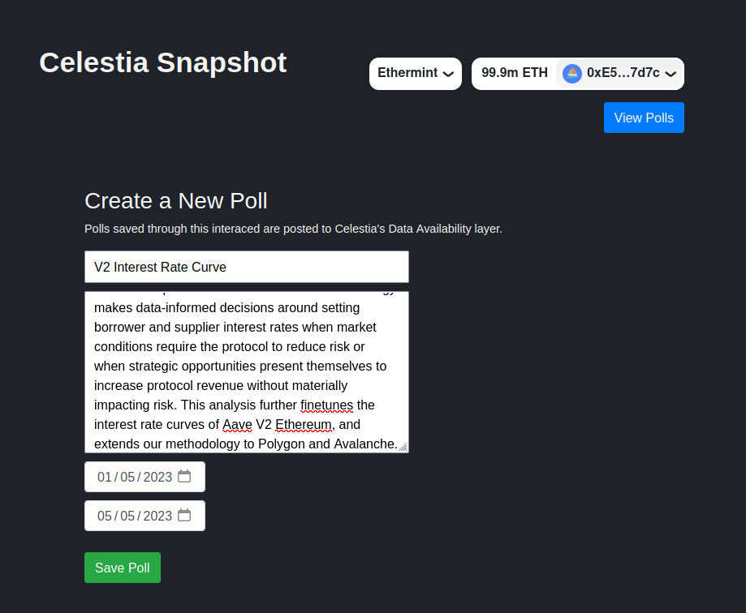

# Celestia Snapshot

Celestia Snapshot is a polling system built on top of Ethermint, an EVM-compatible implementation utilising Tendermint. More specifically it is an Ethereum-based sovereign rollup that uses Cosmos-SDK and Celestia as its data availability layer.


Celestia Snapshot is a work in progress whose purpose is to allow for on-chain voting on low fee gas networks.

## Prerequisites

* A Celestia node (light or full). It should be reachable from wherever you run this rollup.
* jq
* node and yarn
* Ethermint (see below)
    ```sh
    git clone https://github.com/celestiaorg/ethermint.git
    cd ethermint
    make install

    bash init.sh
    ```
    
    Before running bash init.sh you may want to change the `KEY` variable.


## Installation
1) Clone this repo
2) Execute "`NODE_URL=http://xxx.xxx.xxx.xxx:26659 init.sh`" where NODE_URL points to a Celestia node.

The init.sh script will deploy the Polling contract, extract the contract's address, install the required frontend dependencies and configure the frontend.

After running init.sh you should have a .env.local with the address of your newly deployed contract.

The script will also spawn up a local version of Ethermintd which you can terminate by running the following

```sh
kill $(ps aux | grep 'ethermint' | awk '{print $2}')
```


### Network Selection
You'll need to add your Ethermint Chain to MetaMask.

1) Open your MetaMask wallet and click "Ethereum Mainnet" to open the dropdown.
2) Select "Add network"
3) Then "Add network manually"
4) Enter the following details:

    * Network Name: Ethermint
    * New RPC URL: http://localhost:8545 or https://your.custom.ip.address:port
    * Chain ID: 9000
    * Currency symbol: CTE

You'll also need a test account to submit transactions with. Luckily, the ethermind init.sh script creates accounts that you can import into MetaMask. 

```sh
ethermintd keys unsafe-export-eth-key mykey --keyring-backend test
```

Replace "mykey" if you've changed the name of the key in the init.sh script. You can then copy and paste the private key shown on your terminal.


## Frontend 

The frontend is a React/Bootstrap SPA. You'll find the main application logic in src/App.jsx.



To start the frontend in dev cd into the frontend directory and execute `yarn dev`

The frontend should be available at http://localhost:5173/